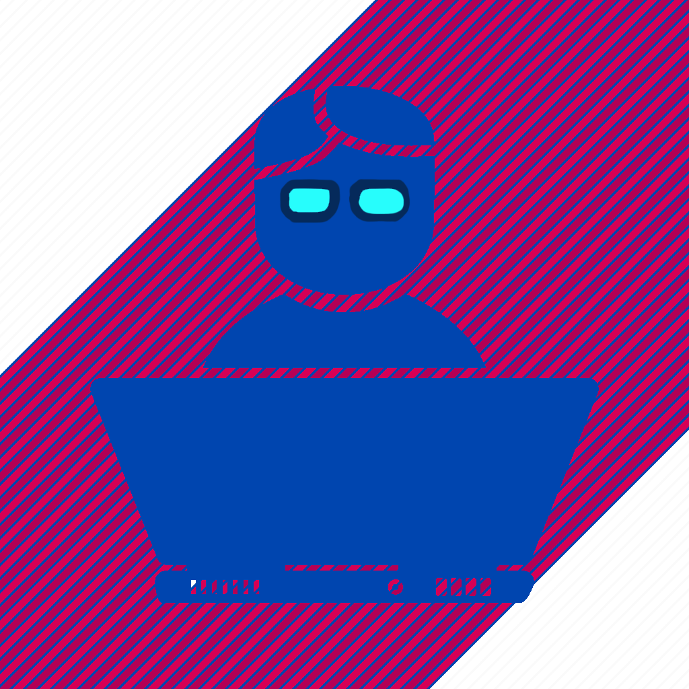

  

<h1 align="center">
  Hello! 
   
  I'm 
  
  
  $\color{#f4007e}{Vetrov}$ $\color{#f4007e}{Timur}$ 
  !
</h1>

<blockquote align="center">
  
"Learning new things is my hobby

  
Self-development is my vacation

  
Programming is my passion"

</blockquote>

# 🙋‍♂️**$\color{#f4007e}{About}$ $\color{#f4007e}{Me}$**

### 🚀$\color{#f4007e}{Vetrov}$ $\color{#f4007e}{Timur}$  
*Graduated Bachelor \ Magistracy (with honors) - MIREA - Russian University of Technology* 

    
 - I love to code, study and try to implement what I have learned in my pet-projects.❤️ 

    
 - I like to read books and play sports.📚💪

    
 - I always set a goal and strive to achieve it.😎 

    
 - I adhere to the position → “movement is life”❗ 

## 👨💻 $\color{#f4007e}{Frontend}$ $\color{#f4007e}{Developer}$ 

### 🛠️**$\color{#f4007e}{Skills:}$**

<table>
  <tr>
    <b>Languages</b>
  </tr>
  <tr>
    <td>
      
    </td>
    <td>
      
    </td>
    <td>
      
    </td>
    <td>
      
    </td>
  </tr>
</table>
<table>
  <tr>
    <td><b>Frameworks</b></td>
  </tr>
  <tr>
    <td>
      
    </td>
  </tr>
</table>
<table>
  <tr>
    <td colspan="4"><b>Tools</b></td>
  </tr>
  <tr>
    <td>
      
    </td>
    <td>
      
    </td>
    <td>
      
    </td>
    <td>
      
    </td>
    <td>
      
    </td>
  </tr>
</table>
<table>
  <tr>
    <b>Project builder</b>
  </tr>
  <tr>
    <td>
      
    </td>
    <td>
      
    </td>
  </tr>
</table>
<table>
  <tr>
    <td><b>UI-testing</b></td>
  </tr>
  <tr>
    <td>
      
    </td>
  </tr>
</table>

### 🛠️**$\color{#f4007e}{My}$ $\color{#f4007e}{development}$ $\color{#f4007e}{goals:}$** 

- **Advanced training in front-end technology stacks**
- **Exploring the backend technology stack:**

<h3 align="center">

🔎$\color{#f4007e}{Find}$ $\color{#f4007e}{me}$ $\color{#f4007e}{around}$ $\color{#f4007e}{the}$ $\color{#f4007e}{web}$🌎
</h3>
<table align="center" width="100%">
  <tr>
    <td align="center">
      <table align="center" width="100%">
        <tr>
          <td align="center">
            
          </td>
          <td align="center">
            <table align="center" width="100%">
              <tr>
                <td align="center">
                  
                </td>
              </tr>
              <tr>
                <td align="center">
                  
                </td>
              </tr>
              <tr>
                <td align="center">
                  
                </td>
              </tr>
              <tr>
                <td align="center">
                  
                </td>
              </tr>
            </table>
          </td>
        </tr>
      </table>
    </td>
    <td align="center">
      
    </td>
  </tr>
</table>

***The information will be updated***

